# Making a 3D Design 
### Eddie Prestegui 10/04/23
So today I will be creating a 3D design using [Blender](https://www.blender.org). Blender is a powerful open-source (FREE!!!) computer software used for 3D effects, animation, visual effects, and pretty much anything you can think of. Learning Blender can be a bit frustrating at first, its **learnability** (especially key commands) is different from other programs since it has a unique workflow. Once you adapt and learn how to convert your ideas into actual 3D models/designs it becomes second nature to create. 

*Disclaimer*: I am using a Mac so some key commands may not translate accordingly with other operating systems. 

The two main workspace features I will be using are the [layout](https://docs.blender.org/manual/en/latest/interface/window_system/workspaces.html) and [shading](https://docs.blender.org/manual/en/latest/interface/window_system/workspaces.html) features. When I open a new project I'm hit with the default screen with three objects: a cube, a camera, and a light. For now, I’m just going to delete the cube and light. Usually when we want to delete something we select the object we want to delete and press delete on our keyboards, but that won't work in Blender. I noticed that Blender uses a whole new system of key commands to work through, so in this case, if I select the cube and *shift-click* the light and then *press X* and click on *delete* it will delete what I selected. With just the camera left let's observe Blender’s **visual mapping**, I can distinguish what each feature may do by how it looks. The icons help a lot, you could almost predict what it could do based on how it appears. The main components are in the middle, and the edit options are on the right and left side, it's pretty obvious that we are using the middle part as the main focus area. You could also add multiple workspace tabs by hovering your mouse on any four corners and once a plus sign appears simply click and drag to add another workspace tab.   

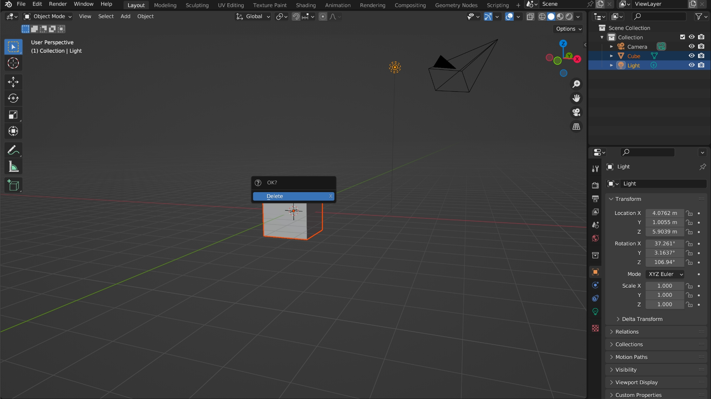 

Before I move on, I want to make sure to save my project by:
1. Pressing *command+S*
2. Picking my destination (I recommend the desktop so it's easily accessible)
3. Name it
4. & finally select Save Blender file 

Let’s add some text! Finding out how to add text should be straightforward. By selecting *add* (under layout) or using the key command *shift+A* and selecting the text. To change the [navigation view](https://docs.blender.org/manual/en/latest/editors/3dview/navigate/introduction.html) (so I can see the text from above) I selected the *z-axis* (making sure it’s in the positive value). To edit the text *pressing tab* (brings us to edit mode), I’ll type “UX” as my design, and *pressing tab* again to change from edit mode back to object mode.  

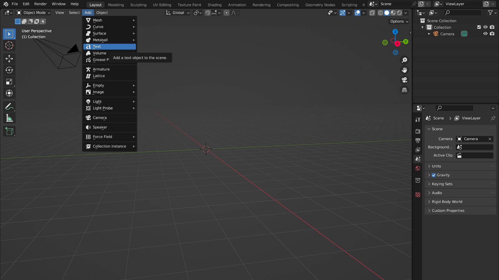 

Now that I have my text set out I want to resize it. Selecting the text > pressing *s* > and use the trackpad or mouse to resize it (Left to resize it to a smaller amount, right to resize it to a bigger amount). Let’s rotate the text so it’s standing straight up. Selecting the text > pressing *r* (rotate) > press *x* (x-axis) > type *90* (90 degrees) > Enter. If I want to extrude the text I have to select the data on the right side (a) under geometry. [Extrude](https://docs.blender.org/manual/en/2.79/modeling/meshes/editing/duplicating/extrude.html) is the amount of depth of an object in Blender (in most graphic design programs as well), so right now my text is in a 2D format. I could change the extrude amount to whatever I see fit, I’ll extrude it to 0.06m. I should have something like this: 

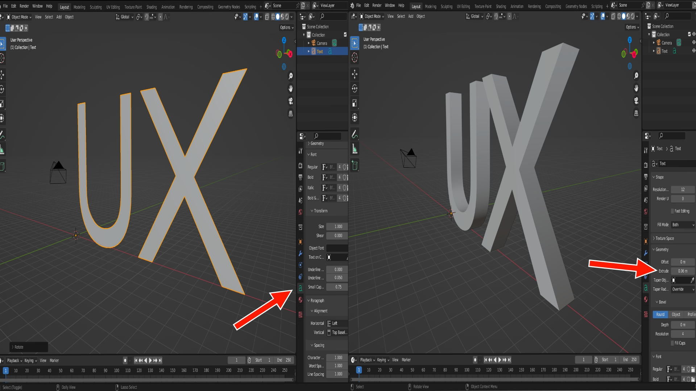

Cool! Now I can start shaping my object. I want to make sure the origin is set in the middle that way if I want to change its direction or animate this in the future it’ll do so accordingly (sets it in the middle of the object). Selecting my text again > right click > set origin > origin to geometry. 

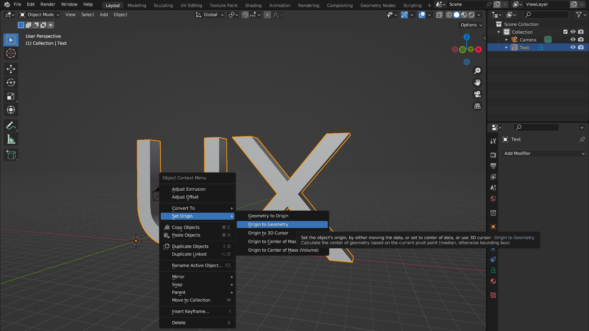

To sculpt and edit the text properly I must convert it into a mesh material. To do that select the text > right-click > convert to > mesh. Now the text is in a material form. This step is vital! You can see the difference if we hit *tab*. Before I could only edit the text by writing in words, now I can edit a specific area, which is split between the black lines. Press *tab* again to go back to object mode. You know you made a mistake if you start sculpting your object and it doesn't work as it was intended. It usually distorts the text in a bad way. Memorizing this is very important because that way you will know the root of the problem.    

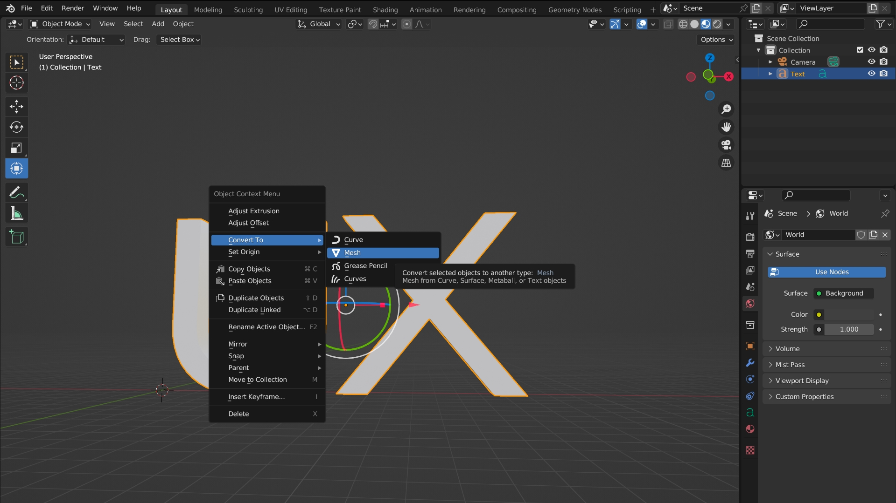

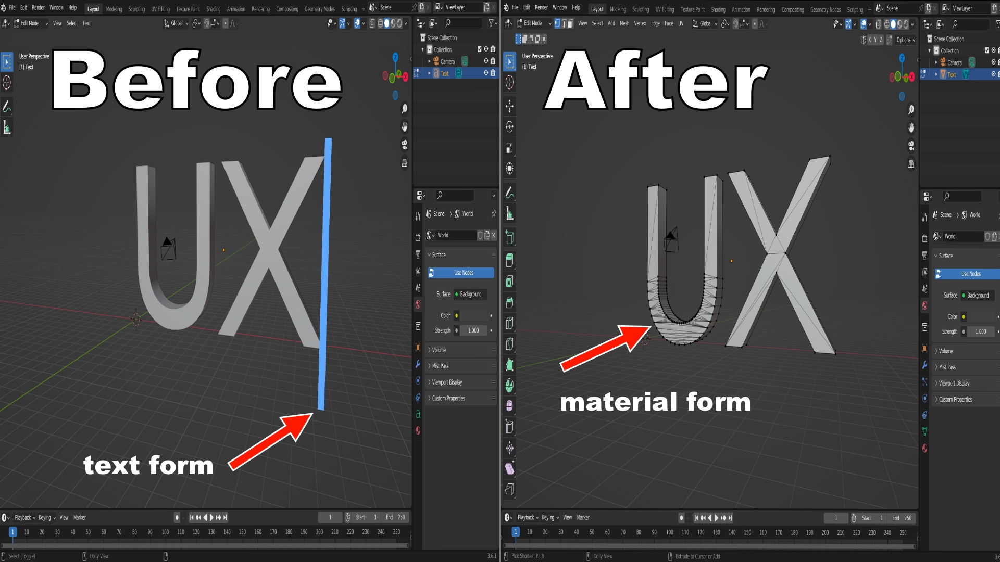

Let’s add a [modifier](https://docs.blender.org/manual/en/latest/modeling/modifiers/introduction.html#index-0). Located on the right side (wrench icon) let's add a remesh modifier. Select smooth shading and let’s change the voxel size until the object design appears. The lower the voxel size the better (make sure you have a good computer for that). Make sure to apply the modifier by selecting the down arrow and selecting apply, if you skip this the remesh won't work when you render your project out. If I go to edit mode (*tab*) you can now see that the object is separated into smaller parts, essentially making it look black. Let's go back to object mode by selecting *tab* again. 

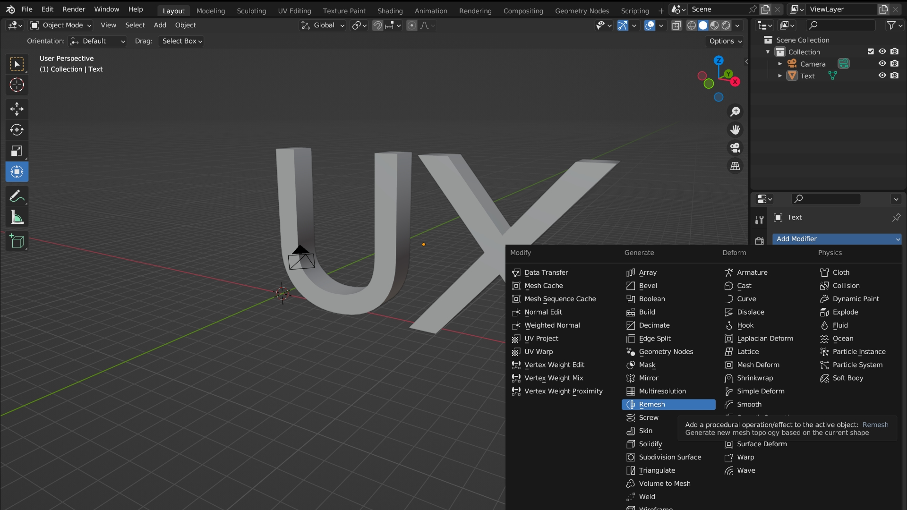

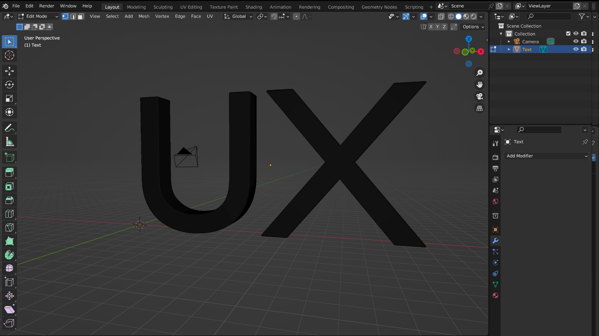

I’m going to be a bit fancy and add a cloud background. Select the [shading workspace](https://docs.blender.org/manual/en/latest/interface/window_system/workspaces.html) feature (the tab on top) and make sure you're on [world view](https://docs.blender.org/manual/en/latest/editors/3dview/display/shading.html) and [world node](https://docs.blender.org/manual/en/latest/render/shader_nodes/output/world.html#world-node). Using [nodes](https://docs.blender.org/manual/en/latest/modeling/geometry_nodes/introduction.html) (bottom page) I'm going to add an [environment texture](https://docs.blender.org/manual/en/latest/render/shader_nodes/textures/environment.html#environment-texture-node) by clicking *shift+A*. Make sure the color output on the environment texture is on the surface input of the world output. You could delete the background node since we won't be using it. Nice, now let's add some [lighting](https://docs.blender.org/manual/en/latest/render/lights/light_object.html). Press *shift+A* and add light, I’ll be using area lighting. I changed the power to 1000w so that way you can see the light effect, I also moved it around until I was satisfied.  

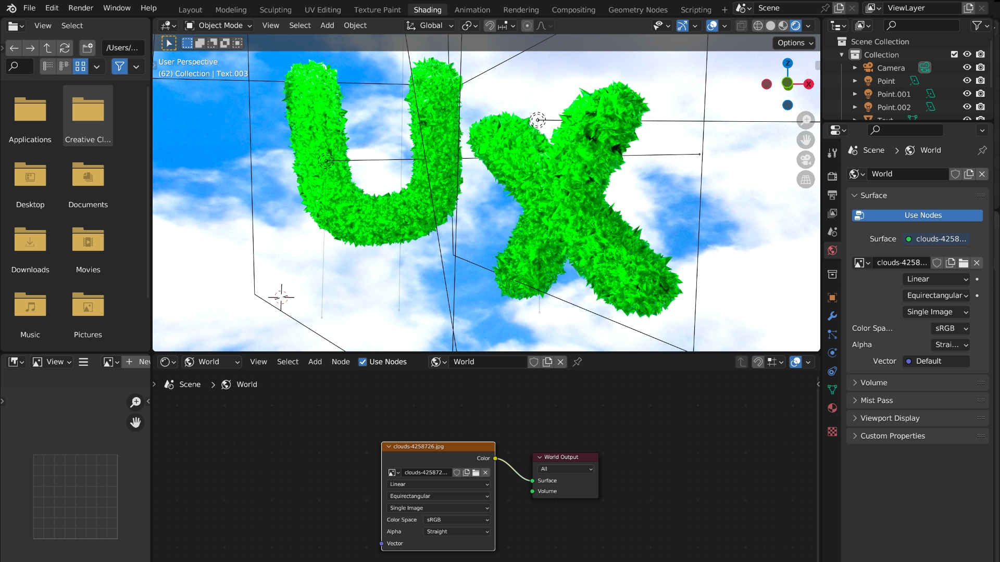
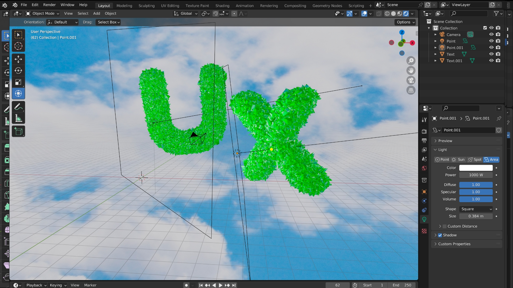

Let’s sculpt our object, under object mode select [sculpt mode](https://docs.blender.org/manual/en/latest/sculpt_paint/sculpting/introduction/general.html). Blender has different types of sculpt types you can choose from, I’ll select the mesh filter. You could change between each effect, I chose inflate and random. With your mouse click on your object until you're satisfied with what you got. Now I'm going to start adding materials. First I'm going to change the shading view to [render](https://docs.blender.org/manual/en/latest/editors/3dview/display/shading.html) (The four circles on the top right; far right circle). Under the material tab on the right side, I’ll get rid of the material and add a new one. I changed the color to green, added a bit of a metallic look, and turned the roughness down to 0. I also separate my object in two so I have individual control between each letter. To do that switch to edit mode select one letter, I choose x, and then *press L* (to select the whole object) then *press P* and select selection. It should now be its own thing. Now our object is looking like an emerald. 

Since I didn't delete the camera it should be in the project. However, I do want to change the dimensions of the camera to do that select [output](https://docs.blender.org/manual/en/latest/render/output/properties/format.html) on the right side it should look like a printer. I'm going to change the pixels to a square image so 1920 x 1920 works for me. To view the camera results click on the camera icon under options, I want to make the design fit the whole camera view so I’ll do that by moving it around. 

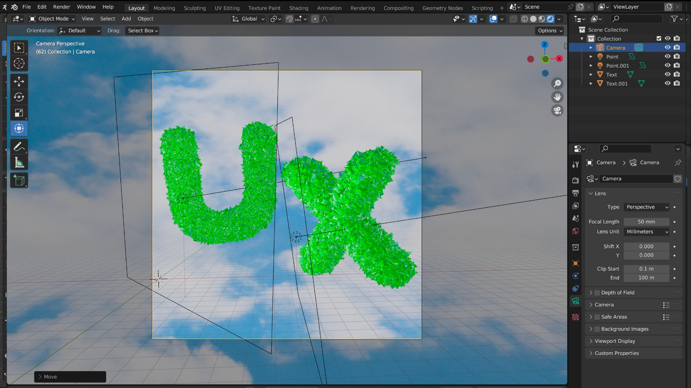

A couple of things need to be tweaked on the [render settings](https://docs.blender.org/manual/en/latest/render/eevee/render_settings/index.html) (camera icon, right side) to make sure our render results come out as accurately as possible. I selected ambient occlusion, bloom, screen-space reflections, high-quality normals, and under color management > look > very high contrast. On [output](https://docs.blender.org/manual/en/latest/render/output/properties/output.html), change the output to desktop, file format to JPEG, and quality to 100%. Hit render image or *press F12* a screen should pop up select image > save a copy > name it > and it should appear on your desktop. 

Overall, I would say that this project went smoothly, everything was working as intended. There are so many creative ways to do this. One thing I love about Blender is that you have full control of the [camera](https://docs.blender.org/manual/en/latest/render/cameras.html#cameras), there are so many quirks that are featured in a real camera! I also love the [lighting feature](https://docs.blender.org/manual/en/latest/render/lights/light_object.html), playing around with light helps bring life to the composition, and it’s also a fun way to learn how to use it in real life. Hopefully, you learned something today, thanks for reading!  

